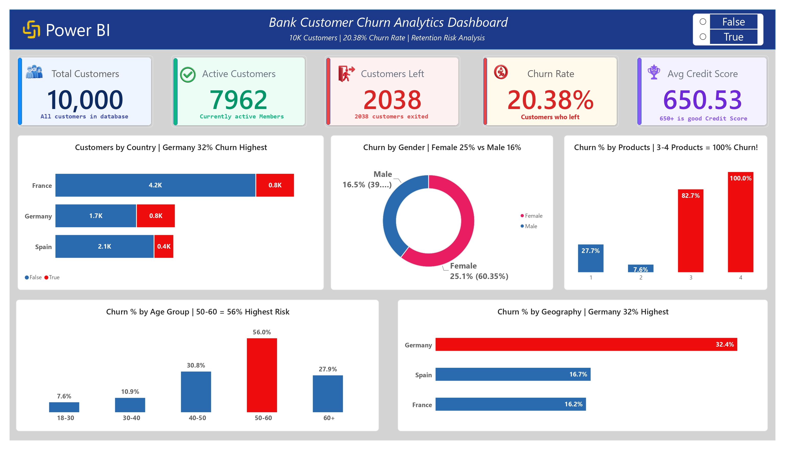

# 🏦 Bank Customer Churn Analysis — SQL Server & Power BI

## 📌 Project Overview
**End-to-end churn analysis of 10,000 bank customers** — from SQL Server validation and segmentation to an interactive Power BI dashboard, uncovering exactly which customer segments are walking out the door and why.
## The Analysis Covers:
- [Business Problem](#business-problem)
- [Dataset Overview](#dataset-overview)
- [Tech Stack](#tech-stack)
- [What This Project Does](#what-this-project-does)
- [Key Insights](#key-insights)
- [My Process](#my-process)
- [SQL Queries](#sql-queries)
- [DAX Measures](#dax-measures)
- [Repository Structure](#repository-structure)
- [How to Run](#how-to-run)
- [Skills Demonstrated](#skills-demonstrated)
- [Results & Conclusion](#results-conclusion)
- [Author](#author)
---
<br>

[](https://www.linkedin.com/in/hafiz-arslan-shafique-bc240203664/)
[](https://github.com/Hafiz-Arslan-Shafique)
[](https://mail.google.com/mail/?view=cm&fs=1&to=hafizarslan3195@gmail.com)
[](tel:+966579594038)



---

<a id="business-problem"></a>
## 🧩 Business Problem
Losing a customer is far more expensive for a bank than retaining one, but retention budget is limited — spending it evenly across all 10,000 customers wastes money on customers who were never going to leave. **The bank needs to know exactly which customer segments are churning at unusually high rates**, and which conditions (geography, activity level, complaints, product holdings) are most associated with that churn, so retention efforts can be targeted instead of blanket.

---

<a id="dataset-overview"></a>
## 🗂️ Dataset Overview
The dataset contains **10,000 bank customers** with demographic and banking attributes, including:
- Customer ID
- Geography (France, Germany, Spain)
- Gender
- Age
- Credit score
- Account balance
- Tenure
- Number of products held
- Card type
- Active-member status
- Complaint status
- Satisfaction score
- Points earned
- **Exited status** — the target field indicating whether the customer left the bank

---

<a id="tech-stack"></a>
## 🧰 Tech Stack
- **SQL Server (T-SQL)** — data validation, cleaning checks, and churn analysis
- **Power BI** — interactive dashboard design and visualization
- **DAX** — KPI and measure calculations
- **Power Query** — data shaping and preparation for Power BI
- **GitHub** — version control and portfolio hosting

---

<a id="what-this-project-does"></a>
## 🎯 What This Project Does
Banks lose revenue every time a customer exits — and it's far cheaper to retain a customer than acquire a new one. I analyzed a 10,000-customer banking dataset to find out **who churns, where, and why**, using **SQL Server** for validation and segment-level churn analysis, then built an **interactive Power BI dashboard** so stakeholders can explore the risk segments themselves.

| | |
|---|---|
| **Customers Analyzed** | 10,000 |
| **Overall Churn Rate** | 20.38% |
| **Highest-Risk Country** | Germany (32.4%) |
| **Highest-Risk Age Group** | 50–60 (56.0%) |
| **Avg Credit Score** | 650.53 |
| **Tools** | SQL Server, T-SQL, Power BI, DAX, Power Query |

---

<a id="key-insights"></a>
## 💡 Key Insights
- **Germany is the highest-risk market** at a 32.4% churn rate — nearly double Spain (16.7%) and France (16.2%).
- **Customers aged 50–60 churn at 56.0%**, by far the highest of any age band, flagging this group as a priority for retention outreach.
- **Product count is a major churn driver** — churn jumps to 82.7% for customers holding 3 products and hits 100.0% for customers holding 4, suggesting an over-selling or service-friction issue at higher product tiers rather than genuine loyalty.
- **Female customers churn more than male customers** (25.1% vs. 16.5%), a gap worth investigating alongside service and product-fit factors.
- **Complaints and inactivity compound risk** — the SQL analysis isolates the exact combinations of geography, complaint status, and activity level where churn concentrates most.

---

<a id="my-process"></a>
## 🛠️ My Process
1. **Validated the imported dataset** — confirmed the full 10,000-row customer population and tested `CustomerId` for duplicates before trusting any aggregation.
2. **Calculated the core churn KPI** — total customers, customers who exited, and overall churn percentage.
3. **Segmented churn across every major dimension** — activity status, complaint status, geography, card type, and satisfaction score — to see where risk concentrates.
4. **Built a multi-dimensional risk query** combining geography, complaint status, and activity status to surface the highest-risk customer profiles in one result set.
5. **Modeled and visualized results in Power BI**, translating the SQL findings into KPI cards and segment-level visuals for a non-technical, business-ready dashboard.

<a id="sql-queries"></a>
<details>
<summary><b>📂 See full SQL queries with explanations</b></summary>

### 1. Customer Population Check
```sql
SELECT COUNT(*) AS Total_Customers 
FROM dbo.Bank_Customer_Churn;
```
**Purpose:** Confirms all 10,000 customer records were imported correctly — always the first step before any analysis.

### 2. Primary Key / Duplicate Check
```sql
SELECT CustomerId, COUNT(*) AS Duplicate_Count
FROM dbo.Bank_Customer_Churn
GROUP BY CustomerId
HAVING COUNT(*) > 1;
```
**Purpose:** Verifies `CustomerId` is unique, protecting every downstream aggregation from being skewed by duplicate records.

### 3. Overall Churn Rate (Main KPI)
```sql
SELECT
    COUNT(*) AS Total_Customers,
    SUM(CAST(Exited AS INT)) AS Customers_Who_Left,
    CAST(SUM(CAST(Exited AS INT)) * 100.0 / COUNT(*) AS DECIMAL(5,2)) AS Churn_Percent
FROM dbo.Bank_Customer_Churn;
```
**Purpose:** Calculates the single most important number in the project — what percentage of the customer base has left the bank.

### 4. Churn by Activity Status
```sql
SELECT 
    IsActiveMember,
    COUNT(*) AS Total_Customers,
    SUM(CAST(Exited AS INT)) AS Customers_Left,
    CAST(SUM(CAST(Exited AS INT)) * 100.0 / COUNT(*) AS DECIMAL(5,2)) AS Churn_Percent
FROM dbo.Bank_Customer_Churn
GROUP BY IsActiveMember
ORDER BY IsActiveMember DESC;
```
**Purpose:** Tests whether inactive members churn more than active ones — a classic early-warning signal for retention teams.

### 5. Churn by Complaint Status
```sql
SELECT 
    Complain,
    COUNT(*) AS Total_Customers,
    SUM(CAST(Exited AS INT)) AS Customers_Left,
    CAST(SUM(CAST(Exited AS INT)) * 100.0 / COUNT(*) AS DECIMAL(5,2)) AS Churn_Percent
FROM dbo.Bank_Customer_Churn
GROUP BY Complain
ORDER BY Complain DESC;
```
**Purpose:** Checks whether a logged complaint is a strong leading indicator of churn.

### 6. Churn by Geography
```sql
SELECT Geography, COUNT(*) AS Total,
    SUM(CAST(Exited AS INT)) AS Customers_Left,
    CAST(SUM(CAST(Exited AS INT)) * 100.0 / COUNT(*) AS DECIMAL(5,2)) AS Churn_Percent
FROM dbo.Bank_Customer_Churn
GROUP BY Geography
ORDER BY Churn_Percent DESC;
```
**Purpose:** Ranks countries by churn rate to identify the highest-risk market — this is where Germany's 32.4% churn rate surfaces.

### 7. Churn by Card Type
```sql
SELECT Card_Type, COUNT(*) AS Total,
    SUM(CAST(Exited AS INT)) AS Customers_Left,
    CAST(SUM(CAST(Exited AS INT)) * 100.0 / COUNT(*) AS DECIMAL(5,2)) AS Churn_Percent
FROM dbo.Bank_Customer_Churn
GROUP BY Card_Type
ORDER BY Churn_Percent DESC;
```
**Purpose:** Tests whether holding a premium card type is associated with better customer retention.

### 8. Churn by Satisfaction Score
```sql
SELECT Satisfaction_Score, COUNT(*) AS Total,
    SUM(CAST(Exited AS INT)) AS Customers_Left,
    CAST(SUM(CAST(Exited AS INT)) * 100.0 / COUNT(*) AS DECIMAL(5,2)) AS Churn_Percent
FROM dbo.Bank_Customer_Churn
GROUP BY Satisfaction_Score
ORDER BY Satisfaction_Score;
```
**Purpose:** Examines whether low satisfaction scores translate into higher churn — built specifically to feed a Power BI trend chart.

### 9. Riskiest Customer Profile (Final Check)
```sql
SELECT 
    Geography,
    Complain,
    IsActiveMember,
    COUNT(*) AS Total,
    SUM(CAST(Exited AS INT)) AS Customers_Left,
    CAST(SUM(CAST(Exited AS INT)) * 100.0 / COUNT(*) AS DECIMAL(5,2)) AS Churn_Percent
FROM dbo.Bank_Customer_Churn
GROUP BY Geography, Complain, IsActiveMember
ORDER BY Churn_Percent DESC;
```
**Purpose:** Combines three risk factors at once to pinpoint the exact customer profile most likely to churn — the single most actionable query in the project for a retention team.

</details>

<a id="dax-measures"></a>
<details>
<summary><b>📊 See Power BI DAX measures</b></summary>

```DAX
Total Customers = COUNTROWS(Bank_Customer_Churn)

Active Customers = CALCULATE([Total Customers], Bank_Customer_Churn[IsActiveMember] = 1)

Customers Left = CALCULATE([Total Customers], Bank_Customer_Churn[Exited] = 1)

Churn Rate % = DIVIDE([Customers Left], [Total Customers])

Average Credit Score = AVERAGE(Bank_Customer_Churn[CreditScore])
```
*(DAX measures reconstructed to match the dashboard's KPI logic.)*

</details>

---
<a id="repository-structure"></a>
## 📁 Repository Structure
```text
bank-customer-churn-sql-powerbi/
├── 01_sql_queries/
│   └── bank_customer_churn_analysis.sql
├── 02_powerbi_file/
│   └── bank_customer_churn_dashboard.pbix
├── 03_dashboard_images/
│   └── bank_customer_churn_dashboard.png
├── 04_dataset/
│   └── bank_customer_churn_dataset.xlsx
├── Final Report.pdf
└── README.md
```

---
<a id="how-to-run"></a>
## 🚀 How to Run
**SQL Server:** Open SSMS → create/select database `BankChurnDB` → import the dataset into table `dbo.Bank_Customer_Churn` → run `bank_customer_churn_analysis.sql` in order.
**Power BI:** Open `bank_customer_churn_dashboard.pbix` → update the data source if needed → click **Refresh** → explore via the True/False churn filter and dashboard visuals.

---

<a id="skills-demonstrated"></a>
## 🎓 Skills Demonstrated
**SQL Server:** Data validation, duplicate/primary-key checks, KPI calculation, multi-dimensional `GROUP BY` segmentation, `HAVING`, type casting, percentage analysis
**Power BI:** Dashboard design, KPI cards, DAX measures, segment-level visualization, interactive filtering
**Analytical thinking:** Turning raw customer records into a prioritized, business-ready view of retention risk


---

<a id="results-conclusion"></a>
## 🏁 Results & Conclusion
This analysis directly answers the business problem: **where should the bank focus retention effort to get the most impact from a limited budget?**

- **Germany should be the top retention priority.** Its churn rate (32.4%) is nearly double Spain's (16.7%) and France's (16.2%), meaning market-specific retention campaigns will outperform a one-size-fits-all approach.
- **Customers aged 50–60 need proactive outreach**, not reactive win-back offers — this age band churns at 56.0%, far above every other segment, and is likely leaving for reasons (retirement transitions, service fit, competitor offers) worth investigating directly with customers.
- **The 3–4 product tier is a retention red flag, not a loyalty signal.** Churn reaches 82.7–100% for customers holding 3 or 4 products, which suggests these customers may have been over-sold or are experiencing service friction rather than being "stickier" because they hold more products. This is a strong candidate for a follow-up service-quality or cross-sell review.
- **Complaints and inactivity are early-warning signs**, not just outcomes — resolving complaints faster and re-engaging inactive members before they exit is likely cheaper than win-back campaigns after the fact.

**Bottom line:** rather than spending retention budget evenly across 10,000 customers, the bank can concentrate effort on a specific, data-backed slice — Germany, the 50–60 age group, and customers with 3+ products — and expect a meaningfully higher return on every retention dollar spent.

---
<a id="author"></a>
## 👨‍💻 Author
**Hafiz Arslan Shafique**
Data Analyst | SQL Server · Power BI · Excel
📧 [Email](https://mail.google.com/mail/?view=cm&fs=1&to=hafizarslan3195@gmail.com) · 💼 [LinkedIn](https://www.linkedin.com/in/hafiz-arslan-shafique-bc240203664/) · 🗂️ [GitHub](https://github.com/Hafiz-Arslan-Shafique) · 📞 Phone: +966 57 959 4038
